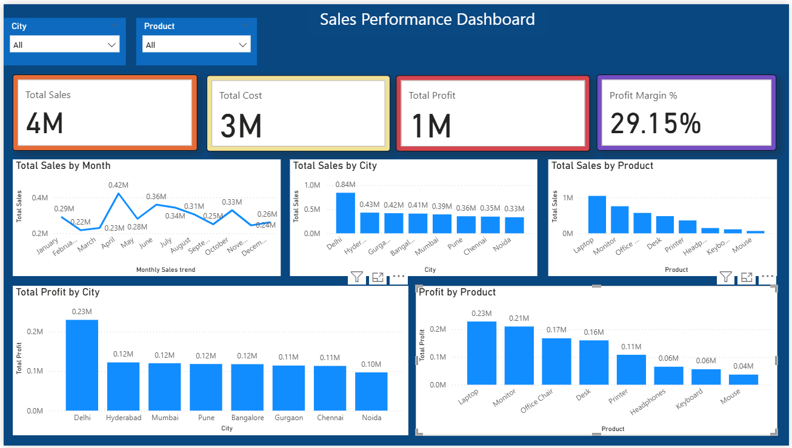

# Sales Performance & Profitability Dashboard | Power BI

An interactive Power BI dashboard designed to analyze sales performance,
profitability, products, cities and monthly sales trends.

## 📊 Dashboard Preview


## 🎯 Project Objective

The objective of this project is to transform raw sales data into an
interactive business dashboard that helps analyze:

- Overall sales performance
- Total cost and profit
- Profit margin
- Monthly sales trends
- Sales performance by city
- Sales performance by product
- Profit performance by city
- Profit performance by product

## 🛠️ Tools & Technologies

- Power BI
- Power Query
- DAX
- Data Modeling
- Excel

## 🔄 Data Preparation

The raw sales data was cleaned and transformed using Power Query.

Key steps included:

- Removed unnecessary data
- Checked data types
- Handled data inconsistencies
- Created dimension tables
- Prepared data for analysis
- Built relationships between tables

## 🧩 Data Model

The project uses a star-schema approach with:

### Fact Table
- Fact Sales

### Dimension Tables
- Dim Date
- Dim Product
- Dim City

Relationships were created between the fact and dimension tables to support
interactive analysis.

## 📐 DAX Measures

Key DAX measures created for the dashboard include:

- Total Sales
- Total Cost
- Total Profit
- Profit Margin %

Example:

```DAX
Total Sales =
SUMX(
    'Fact Sales',
    'Fact Sales'[Quantity] * 'Fact Sales'[Unit_Price]
)

## Dashboard Preview


